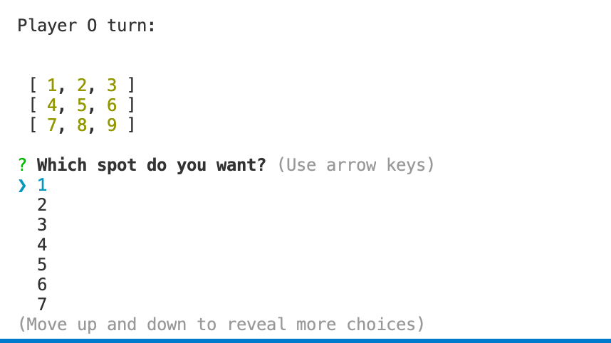

# tic-tac-toe

This is a command line Tic Tac Toe game that uses inquier to prompt the players. There is a randominize function that determines if player "X" or player "O" goes first.

The inquirer will ask the player will spot they would select. The Tic Tac Toe board is represented by a 2D array and has numbers to indicate the specific spot.

Once, the spot is selected, the checkWinner function is called to see if there is a winner. If there is not, the next player goes. This continues only a game is won or there is a draw.



## Development Highlights

- Use an array to represent a board.

- Created algorithim to check if a game is over according to the board array.

- Loop through the board array to update the player's move.

## Installation

1. Install node modules at root.

```
npm i
```

2. Start Game.

```
node index.js
```

## Code Highlights

The user selects which spot in the array that they want. Afterwards, the app does a nested loop to find which index corresponds to the selection and makes an update.

```JavaScript
    const inputChoice = await inquirer
        .prompt([
            {
                type: 'list',
                name: 'arrayIndex',
                message: 'Which spot do you want?',
                choices: avaibleMoves
            }
        ])
    for (let row of board) {
        for (let i = 0; i < row.length; i++) {
            if (row[i] === inputChoice.arrayIndex) {
                row[i] = player
            }
        }
    }
```

## Technologies

### Backend

- [Node.js](https://nodejs.org/en/)

### Dependency

- [Inquirer](https://www.npmjs.com/package/inquirer)

## Credits

|                           |                                                                                                                                                                                                       |
| ------------------------- | ----------------------------------------------------------------------------------------------------------------------------------------------------------------------------------------------------- |
| **David Anusontarangkul** | [ LinkedIn](https://www.linkedin.com/in/anusontarangkul/) [ GitHub](https://github.com/anusontarangkul) |

## License

[](https://opensource.org/licenses/MIT)
